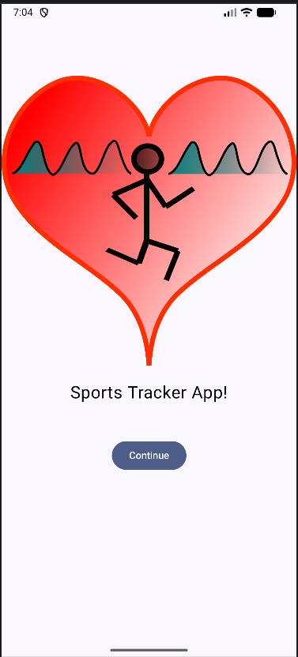
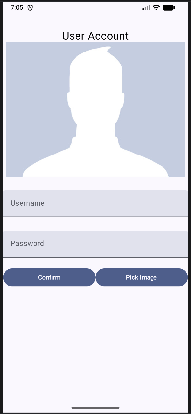
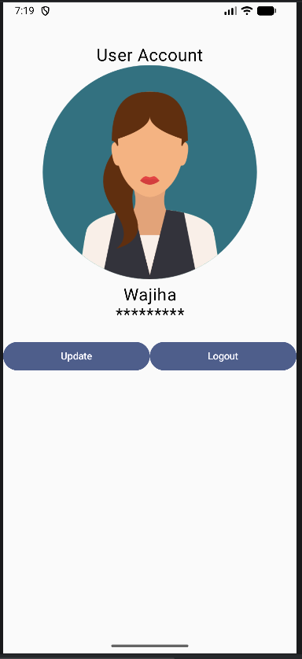

# Sports Tracker App

A continuing Android learning project built with **Kotlin** and **Jetpack Compose**.

This repository will keep evolving as I learn new Android development concepts, improve the UI, and add more features over time.

## Current App Flow

The app currently contains three main UI states:

1. **Home Screen**
   - Displays the Sports Tracker logo.
   - Contains a Continue button.
   - Clicking Continue opens the User Account editing screen.

<p align="center">
  
</p>

2. **User Account Editing Screen**
   - Allows the user to enter a username.
   - Allows the user to enter a password.
   - Allows the user to select a profile image from the device.
   - Contains a Confirm button.
   - After confirming, the app switches to the User Account display screen.
     

<p align="center">
  
</p>

3. **User Account Display Screen**
   - Displays the saved username.
   - Displays the password as hidden text.
   - Displays either the default profile image or the image selected by the user.
   - Contains Update and Logout buttons.
     


<p align="center">
  
</p>


## Update Button

When the user clicks **Update**:

- The app returns to editing mode.
- The existing username is kept.
- The existing password is kept.
- The selected image is kept.
- The user can edit the existing information.

## Logout Button

When the user clicks **Logout**:

- The app returns to the home screen.

## Image Selection

The app can request an image from another Android application, such as Gallery or Files, using an Android `Intent`.

```kotlin
val intent = Intent(Intent.ACTION_GET_CONTENT)
intent.type = "image/*"
```

The image picker is launched using an activity result launcher:

```kotlin
resultLauncher.launch(intent)
```

After the user selects an image, the returned image `Uri` is retrieved:

```kotlin
val uri = result.data?.data
```

The `Uri` acts as a reference to the selected image.

The image reference is stored using Compose state:

```kotlin
var imageUri by remember {
    mutableStateOf<Uri?>(null)
}
```

If `imageUri` is `null`, the app displays the default profile image.

If an image has been selected, the app displays it using Coil's `AsyncImage`.

## State Management

The main app composable currently owns the shared state:

```kotlin
var username by remember { mutableStateOf("") }
var password by remember { mutableStateOf("") }
var currentScreen by remember { mutableStateOf("home") }
var isEditingMode by remember { mutableStateOf(true) }
var imageUri by remember { mutableStateOf<Uri?>(null) }
```

These variables control what is displayed and preserve user information between the editing and display states.

## Screen Switching

The app does not use Navigation Compose yet.

For now, screen switching is controlled using state and `if / else` statements:

```kotlin
if (currentScreen == "home") {
    HomeScreen()
} else {
    if (isEditingMode) {
        AccountScreen()
    } else {
        UserAccountDisplay()
    }
}
```

When state changes, Jetpack Compose recomposes the UI and displays the correct screen.

## Current Structure

```text
MainActivity
    |
    └── SportsTrackerApp
            |
            ├── HomeScreen
            |
            ├── AccountScreen
            |
            └── UserAccountDisplay
```

`SportsTrackerApp` acts as the main controller and owns shared state.

The individual screen composables mainly focus on their own UI and use callbacks to notify the parent when an action occurs.

## Concepts Practiced So Far

`Kotlin` • `@Composable` • `Column` • `Row` • `Text` • `TextField` • `Button` • `Image` • `Modifier`  
`remember` • `mutableStateOf` • State-driven UI • Recomposition • Lambdas • State hoisting  
`if / else` • Password transformation • `Intent` • Activity Result Launcher • `Uri` • Coil `AsyncImage`

